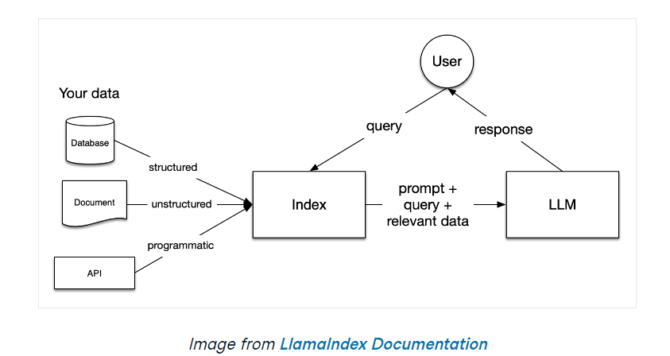
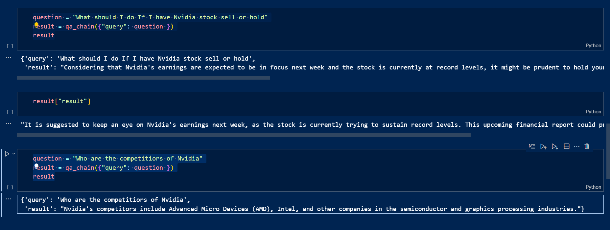

# LangSmith Application with GPT-4o

This project demonstrates the integration of LangSmith, an application development platform for Large Language Model (LLM) applications, with GPT-4o for question-answering tasks.

## Overview



This project showcases the following workflow:

1. **Data Loading**: Utilizing the `WebBaseLoader` from LangChain Community to load data from an Investopedia article about Nvidia's revenue generation.

2. **Conversion to Vector Database**: Using `ObjectBox` from LangChain ObjectBox module to convert the loaded data into a vector database.

3. **RAG Pipeline Creation**: Establishing a RAG (Retrieval-Augmented Generation) pipeline with LangChain's modules to facilitate question-answering tasks.
   The web page used was on Nvidia by investing.com

## Setup

Before running the project, ensure you have the necessary dependencies installed:

```bash
pip install langchain langchain_community langchain_objectbox langchain_openai
```

## Usage

1. Load the data using `WebBaseLoader`:

```python
from langchain_community.document_loaders import WebBaseLoader

loader = WebBaseLoader("https://www.investopedia.com/how-nvidia-makes-money-4799532#:~:text=Nvidia%20(NVDA)%20introduced%20graphics%20processing,vehicles%2C%20robotics%2C%20and%20more.")
data = loader.load()
```

2. Convert data to vector database:

```python
from langchain_objectbox.vectorstores import ObjectBox
from langchain_openai import OpenAIEmbeddings
from langchain_text_splitters import RecursiveCharacterTextSplitter

text_splitter = RecursiveCharacterTextSplitter()
documents = text_splitter.split_documents(data)

vector = ObjectBox.from_documents(documents, OpenAIEmbeddings(), embedding_dimensions=768)
```

# 3. Create a RAG pipeline:

```python
from langchain_openai import ChatOpenAI
from langchain_core.output_parsers import StrOutputParser
from langchain_core.prompts import ChatPromptTemplate
from langchain.chains import RetrievalQA
from langchain import hub

llm = ChatOpenAI(model="gpt-4o")
prompt = hub.pull("rlm/rag-prompt")

qa_chain = RetrievalQA.from_chain_type(
        llm,
        retriever=vector.as_retriever(),
        chain_type_kwargs={"prompt": prompt}
    )

question = "Explain what is langsmith"
result = qa_chain({"query": question })
```


## Result

The project outputs answers to user queries using the RAG pipeline, combining retrieved context with generative capabilities of GPT-4o.
